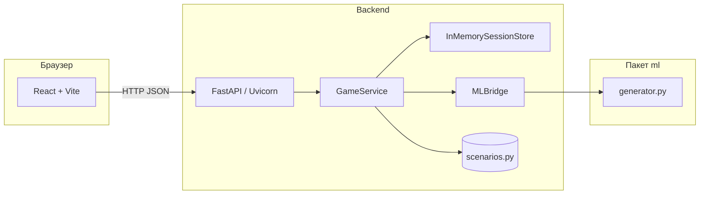

# Архитектура проекта History Simulator

Документ описывает структуру репозитория, роль **FastAPI**, механику **сессий**, связь **backend** и **frontend**, а также поток данных при прохождении исторических сценариев.

---

## 1. Назначение проекта

**History Simulator** — образовательный интерактивный симулятор: пользователь выбирает исторический сценарий, проходит **граф узлов** (ветвления с выбором действий), получает текст сцены и дополнительный комментарий («ответ ИИ»). Состояние прохождения хранится на сервере в рамках **сессии** с уникальным идентификатором.

---

## 2. Структура репозитория

```
history-simulator/
├── backend/                 # HTTP API на FastAPI
│   └── app/
│       ├── main.py          # Точка входа приложения ASGI
│       ├── api/
│       │   └── routes.py    # Маршруты REST API, singleton-сервисы
│       ├── core/
│       │   └── config.py    # Настройки (в т.ч. CORS)
│       ├── data/
│       │   └── scenarios.py # Каталог сценариев и деревья узлов
│       ├── models/
│       │   ├── requests.py  # Pydantic-модели тела запросов
│       │   └── responses.py # Pydantic-модели ответов
│       └── services/
│           ├── game_service.py   # Бизнес-логика игры
│           ├── session_store.py  # Хранение сессий в памяти
│           └── ml_bridge.py      # Мост к текстовому «ИИ-слою»
├── frontend/                # SPA на React + Vite
│   ├── index.html
│   ├── vite.config.js
│   └── src/
│       ├── main.jsx
│       ├── App.jsx
│       ├── api/
│       │   └── client.js    # Все вызовы backend по HTTP
│       ├── pages/
│       │   └── HomePage.jsx # Состояние сессии и UI-поток
│       └── components/      # Список сценариев, история, карта и т.д.
├── ml/
│   └── generator.py         # Генерация intro/ответов по узлу (шаблоны)
├── shared/                  # Зарезервировано под общие артефакты (сейчас пусто)
├── docs/                    # Документация (при необходимости)
├── run_backend.py           # Запуск uvicorn для разработки
└── README.md
```

---

## 3. Высокоуровневая архитектура



- **Frontend** не содержит дерева сценариев целиком для логики переходов: он хранит только то, что пришло с API (`session_id`, текущий узел, путь, посещённые узлы, облегчённое описание дерева для карты).
- **Backend** — единственный источник истины для допустимых переходов, проверки сессии и списка посещённых узлов.

---

## 4. Backend: как устроен FastAPI

### 4.1. Что такое FastAPI в этом проекте

**FastAPI** — веб-фреймворк для Python, который:

- принимает HTTP-запросы;
- сопоставляет URL и метод с **функциями-обработчиками** (маршруты);
- при необходимости **парсит JSON** в Pydantic-модели и **валидирует** ответы по `response_model`;
- отдаёт JSON клиенту.

Приложение создаётся в `backend/app/main.py`:

- Экземпляр `FastAPI(...)` — корневое ASGI-приложение.
- Подключается **CORS middleware**, чтобы браузер на другом origin (например, Vite на порту 5173) мог вызывать API на 8000.
- Через `app.include_router(router)` подключается модуль маршрутов из `backend/app/api/routes.py` с префиксом `/api`.

**Запуск в режиме разработки:** скрипт `run_backend.py` поднимает **Uvicorn** — ASGI-сервер, который передаёт запросы в приложение `backend.app.main:app`.

### 4.2. Слои backend

| Слой | Файлы | Роль |
|------|--------|------|
| Транспорт | `main.py`, `routes.py` | HTTP, статусы, привязка URL к функциям |
| Контракты | `models/requests.py`, `models/responses.py` | Схемы JSON (Pydantic) |
| Доменная логика | `services/game_service.py` | Старт сценария, ход, назад, переход к посещённому узлу |
| Состояние | `services/session_store.py` | Хранение сессий в оперативной памяти процесса |
| Данные | `data/scenarios.py` | Статические списки сценариев и графы `SCENARIO_TREES` |
| «ИИ» | `services/ml_bridge.py` + `ml/generator.py` | Текстовые ответы по сценарию/узлу |

### 4.3. Маршруты API (`routes.py`)

Все эндпоинты сгруппированы под префиксом **`/api`**.

На уровне модуля создаются **один раз** (при импорте) экземпляры:

- `InMemorySessionStore()` — хранилище сессий;
- `MLBridge()` — обёртка над генератором;
- `GameService(session_store, ml_bridge)` — основная логика.

Такой паттерн означает: **один процесс — одно общее хранилище сессий** для всех запросов.

| Метод | Путь | Назначение |
|-------|------|------------|
| `GET` | `/api/health` | Проверка живости сервиса |
| `GET` | `/api/scenarios` | Список доступных сценариев (метаданные) |
| `POST` | `/api/scenarios/start` | Старт: создаётся сессия, возвращается стартовый узел |
| `POST` | `/api/turn/choose` | Выбор действия по `choice_id` в текущем узле |
| `GET` | `/api/node` | Переход к уже посещённому узлу (query: `session_id`, `node_id`) |
| `POST` | `/api/turn/back` | Шаг назад по истории пути (query: `session_id`) |

Корневой маршрут `GET /` в `main.py` возвращает текстовое сообщение о том, что backend запущен (вне префикса `/api`).

### 4.4. Pydantic и `response_model`

Для части эндпоинтов указан `response_model=...`. FastAPI сериализует возвращаемый словарь в JSON и **приводит к объявленной схеме** (удобно для OpenAPI и строгого контракта). Тела запросов для `POST` описаны в `StartScenarioRequest` и `ChooseActionRequest`.

### 4.5. Ошибки

`GameService` при нарушении правил (нет сценария, нет сессии, неверный выбор, узел не из посещённых и т.д.) выбрасывает `HTTPException` с кодами **400**, **403**, **404**, **500**. FastAPI превращает это в JSON-ответ с полем `detail`.

---

## 5. Сессии: создание и удержание

### 5.1. Где живёт сессия

Сессии хранятся в **`InMemorySessionStore`** (`session_store.py`):

- внутри словаря `_sessions: dict[str, SessionState]`, ключ — `session_id`;
- доступ к словарю защищён **`threading.Lock`**, чтобы безопасно обрабатывать параллельные запросы в одном процессе.

### 5.2. Структура `SessionState`

- **`session_id`** — строка UUID v4, выдаётся при создании сессии.
- **`scenario_id`** — какой сценарий выбран.
- **`current_node_id`** — текущий узел в графе.
- **`path_node_ids`** — последовательность узлов по «ходам» (включая переходы к уже посещённым через карту — см. ниже); используется для **«назад»**.
- **`visited_node_ids`** — множество посещённых узлов (порядок сохраняется списком); нужно, чтобы **нельзя было запросить узел, в который пользователь ещё не заходил** через легитимный путь.

### 5.3. Жизненный цикл

1. **Создание** — `POST /api/scenarios/start` с `scenario_id`.  
   `GameService.start_scenario` находит дерево в `SCENARIO_TREES`, берёт `start_node_id`, вызывает `session_store.create_session(...)`. В сессии сразу заполняются путь и посещённые узлы начальной вершиной.

2. **Удержание** — клиент при каждом действии передаёт **`session_id`** (в теле JSON или query). Сервер ищет сессию в памяти. **Cookies и серверные сессии в смысле Flask не используются** — идентификатор полностью на стороне клиента (state в React).

3. **Потеря сессии** — при перезапуске backend процесс очищается: все `session_id` перестают существовать. Новый запуск = новые UUID. Долговременного хранилища (БД, Redis) в проекте нет.

4. **Операции над сессией**
   - **`move_forward`** — после выбора варианта: текущий узел меняется, путь дополняется, новый узел добавляется в `visited_node_ids` при первом визите.
   - **`jump_to_node`** — при переходе к уже посещённому узлу с карты: текущий узел и путь обновляются (узел снова добавляется в конец пути — «навигация по истории» с возможностью уточнить траекторию для кнопки «назад»).
   - **`go_back`** — удаляется последний элемент `path_node_ids`, текущий узел становится предыдущим; если в пути один узел, состояние не меняется.

---

## 6. Игровая логика (`GameService` + `scenarios.py`)

### 6.1. Данные

- **`SCENARIOS`** — плоский список карточек сценариев: `id`, `title`, `period`, `description`.
- **`SCENARIO_TREES[scenario_id]`** — для каждого сценария:
  - `start_node_id`;
  - `nodes` — словарь узлов; у каждого узла: `id`, `title`, `scene_text`, `choices` (каждый выбор: `id`, `text`, `next_node_id`).

Граф задан **явно в коде**, не в БД.

### 6.2. Сборка ответа узла

`_build_node_response` собирает объект узла для JSON:

- поля из дерева (`id`, `title`, `scene_text`, список `choices` без `next_node_id` в ответе);
- **`ai_response`** — строка из `MLBridge.build_node_response` → `ml.generator.generate_node_answer(scenario_id, node_id)` (по сути шаблонные тексты по таблице в `generator.py`).

### 6.3. Дополнительные поля в ответе клиенту

В ответах после старта и хода возвращаются также:

- **`path_node_ids`**, **`visited_node_ids`** — для отображения пути и карты;
- **`tree_nodes`** — упрощённое описание всех узлов дерева (`id`, `title`, `next_node_ids`) для визуализации графа на frontend без дублирования полной логики дерева.

---

## 7. Слой ML (`ml` + `MLBridge`)

- **`MLBridge`** изолирует импорт `ml.generator` от остального backend.
- **`generate_intro`** и **`generate_node_answer`** сейчас реализованы как **детерминированные строки** по словарю ответов; это не вызов внешней LLM API в текущем коде.
- При развёртывании важно, чтобы пакет `ml` был доступен в `PYTHONPATH` так же, как при запуске из корня проекта (как в `run_backend.py`).

---

## 8. Frontend: структура и поток данных

### 8.1. Стек

- **Vite** — сборка и dev-сервер (по умолчанию порт **5173**).
- **React 18** — один корневой экран `HomePage` через `App.jsx`.

### 8.2. API-клиент (`frontend/src/api/client.js`)

Базовый URL зафиксирован:

```text
const API_BASE = "http://127.0.0.1:8000/api";
```

Все запросы идут **напрямую** на backend (без proxy в `vite.config.js`). Значит:

- backend должен быть запущен (например, `python run_backend.py` на **8000**);
- CORS на FastAPI должен разрешать origin страницы Vite — это настроено в `backend/app/core/config.py` (`localhost:5173` и др.).

### 8.3. Состояние в `HomePage.jsx`

- При загрузке страницы — `GET /api/scenarios` для списка сценариев.
- После выбора сценария — `POST /api/scenarios/start`; в state сохраняются `sessionId`, заголовок сценария, `currentNode`, `treeNodes`, `visitedNodeIds`, `pathNodeIds`.
- Выбор действия — `POST /api/turn/choose` с `session_id` и `choice_id`.
- Переход по карте к посещённому узлу — `GET /api/node?...`.
- Назад — `POST /api/turn/back?session_id=...`.

Ошибки сети и HTTP оборачиваются в сообщения пользователю на русском.

### 8.4. Компоненты

- **`ScenarioList`** — выбор сценария до начала игры.
- **`StoryView`** и связанные компоненты — отображение текста, вариантов, пути и карты дерева (детали в `src/components/`).

---

## 9. Связь backend и frontend (итог)

| Аспект | Реализация |
|--------|------------|
| Протокол | **HTTP/HTTPS** (в разработке — HTTP) |
| Формат | **JSON** |
| Аутентификация | Нет; идентификация только по **`session_id`**, передаваемому клиентом |
| CORS | `CORSMiddleware` в FastAPI, список origin в `config.py` |
| Порты (типично) | Frontend Vite: **5173**, Backend Uvicorn: **8000** |
| Связь в коде | Только через `fetch` в `client.js` — общих TypeScript-типов или codegen между репозиториями нет |

---

## 10. Ограничения и замечания по архитектуре

1. **Сессии не переживают рестарт** сервера и не шарятся между несколькими воркерами процесса без внешнего store.
2. **Нет аутентификации** — любой, кто знает `session_id`, может слать запросы (в учебном проекте это обычно приемлемо).
3. **ML-слой** локальный и шаблонный; замена на реальный LLM потребует изменений в `ml/generator.py` и, возможно, конфигурации ключей.
4. Папки **`shared/`** и **`docs/`** в репозитории могут быть пустыми — под общие контракты или документацию их можно наполнить отдельно.

---

## 11. Быстрая схема запроса «сделать ход»

1. Пользователь нажимает вариант в UI.
2. React вызывает `chooseAction(sessionId, choiceId)` → `POST /api/turn/choose`.
3. FastAPI передаёт тело в `GameService.choose_action`.
4. Сервис загружает сессию, проверяет, что `choice_id` есть у текущего узла, берёт `next_node_id`, обновляет сессию через `move_forward`.
5. Собирается новый узел с `ai_response`, плюс обновлённые пути и `tree_nodes`.
6. JSON возвращается в браузер; React обновляет state экрана.

Этого достаточно, чтобы понимать **целостную архитектуру** проекта и место **FastAPI** как HTTP-слоя над игровой логикой и хранилищем сессий в памяти.
